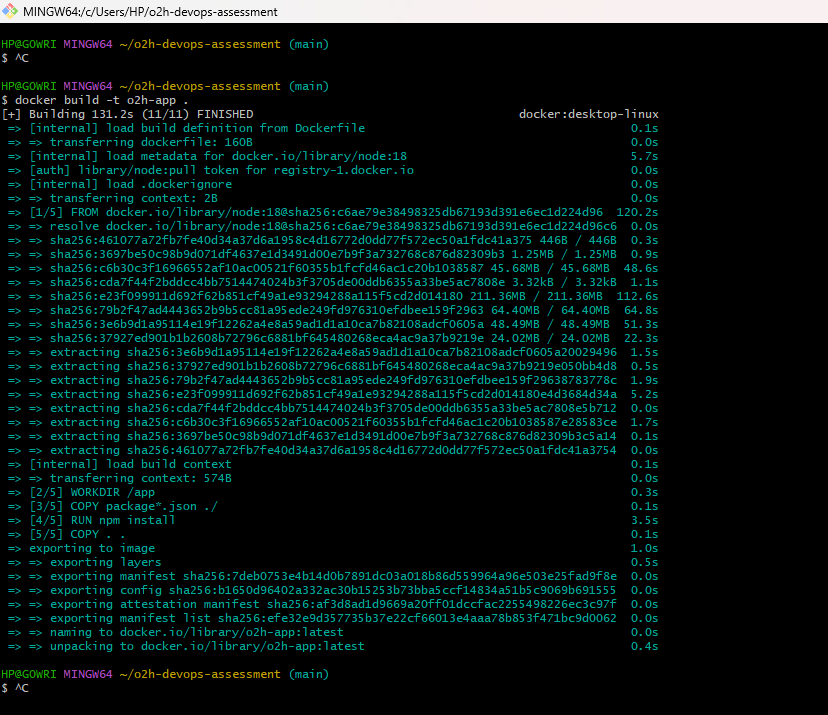
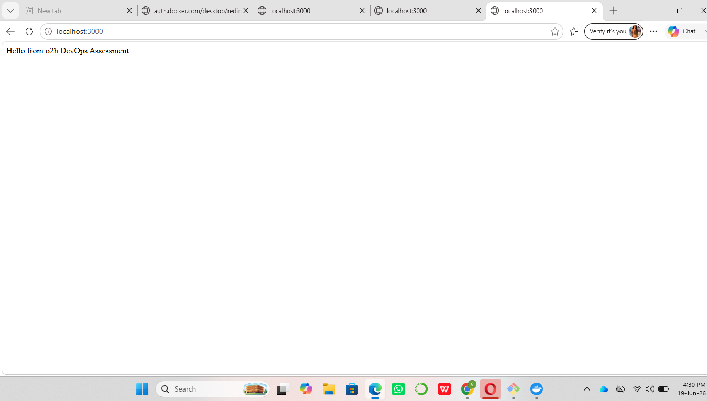
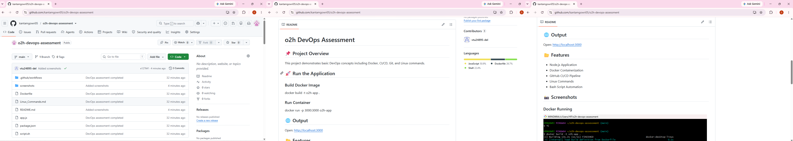

# o2h DevOps Assessment

## 📌
 Project Overview
This project demonstrates basic DevOps concepts including Docker, CI/CD, Git, and Linux commands.

## 🚀 Run the Application

### Build Docker Image
docker build -t o2h-app .

### Run Container
docker run -p 3000:3000 o2h-app

## 🌐 Output
Open: http://localhost:3000

## 📂 Features
- Node.js Application
- Docker Containerization
- GitHub CI/CD Pipeline
- Linux Commands
- Bash Script Automation
## 📸 Screenshots

### Docker Running

### Application Output

### GitHub Repo

---

##  Troubleshooting Scenarios

###  Scenario 1: Docker container exits immediately after startup

**Possible Reasons:**
- Application crashes due to errors in code  
- Incorrect CMD or ENTRYPOINT in Dockerfile  
- Missing dependencies  
- Port or configuration issue  
- Environment variables not set  

**How to Debug:**
- docker logs <container_id>  
- docker run -it o2h-app /bin/bash  
- Check Dockerfile  
- Run application locally  
- Rebuild Docker image  

---

###  Scenario 2: Application works locally but not on server

**What to Check:**
- Server configuration  
- Port and firewall settings  
- Environment variables  
- Network issues  
- Docker status  

**How to Identify Issue:**
- Check logs  
- ps -ef | grep node  
- netstat -tuln  
- curl http://localhost:3000  
- Compare local vs server  

---

## Conclusion
Troubleshooting involves checking logs, configurations, and resolving issues step by step.